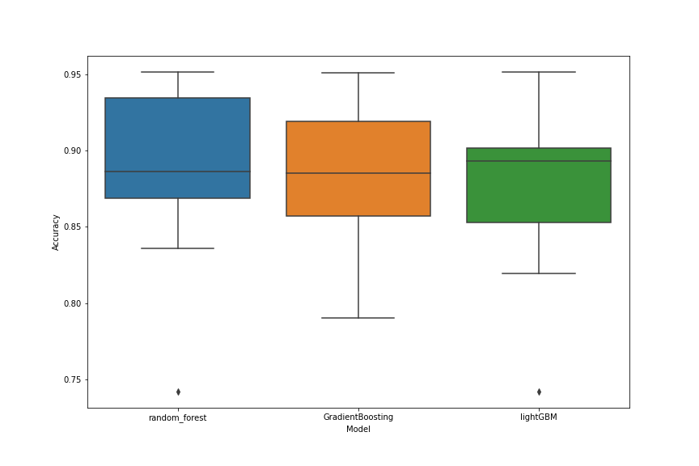
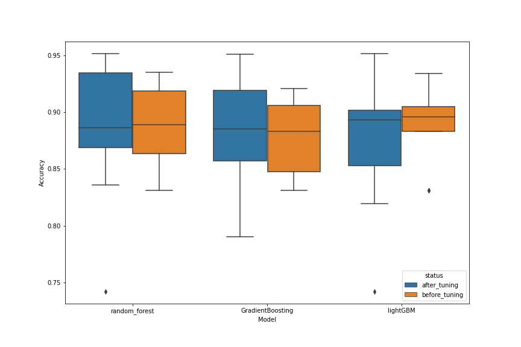
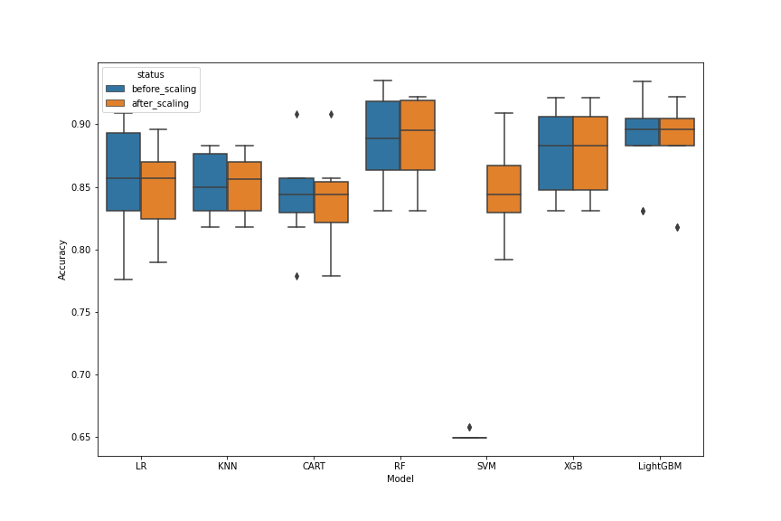

# HealthCare: Diabetes

Application of machine learning to some publicly available healthcare data.

This dataset is a part of original larger dataset from the National Institute of Diabetes and Digestive and Kidney Diseases.
Here the objective is to predict whether a patient has diabetes based on diagnostic measurements

Several constraints were placed on the selection of these instances from a larger database. In particular, all patients here are females at least 21 years old of Pima Indian heritage.

    Pregnancies: Number of times pregnant
    Glucose: Plasma glucose concentration a 2 hours in an oral glucose tolerance test
    BloodPressure: Diastolic blood pressure (mm Hg)
    SkinThickness: Triceps skin fold thickness (mm)
    Insulin: 2-Hour serum insulin (mu U/ml)
    BMI: Body mass index (weight in kg/(height in m)^2)
    DiabetesPedigreeFunction: Diabetes pedigree function
    Age: Age (years)
    Outcome: Class variable (0 or 1)

Number of Instances: 768
Number of Attributes: 8 plus class
For Each Attribute: (all numeric-valued)

# Explorative data analysis
All the features have no missing values.
the distribution of all the features looks like this:-

Through there is no NA values, there are 0 values form glucose, blood pressure, insulin, BMI, skinthickness. Hence replace them with NA as it is impossible for these values to be zero. 
Now check the missing values:  
  

These missing values were replaced with the median values of the respective columns for both the outcomes.

# Creation of additional features

https://www.medicinenet.com/what_is_a_high_insulin_level/article.htm#what_are_normal_insulin_levels  
Based on normal insulin level (16 - 166 mIU/L) three addition class of insulin as low, normal and high were created.
1. low ( <16 )
2. normal ( 16-166 )
3. high ( >166 )

# Model Selection
First I compared seven classification models to find the top three performers. 
models tested:
1. Logistic Regression 
2. KNN
3. Dicision Tree Classification
4. RandomForest Classifier
5. SVM
6. Gradient Boosting Classifier
7. Light GBM

The following plot shows the performance of the above models prior to tuning:

I selected RandomForest, Gradient boosting Classifier and LightGMB for further tuning using GridSearchCV to find the best model.
The following graph shows performance of these models after tuning  
  
## Comparison of model performance before and after tuning
 
looks like RandomForest is giving the best result.

# Effect of scaling data set
The range of the feature values varies a lot (the above histogram plot). Hence, it is a standard practice to scale the data between 0 and 1 for better model performance. I scaled the data using skleran RobustScaler.
Here is the performance of models before and after scaling the dataset.

From the above figure it is clear that the effect of scaling has very little effect upon the models for this dataset.

